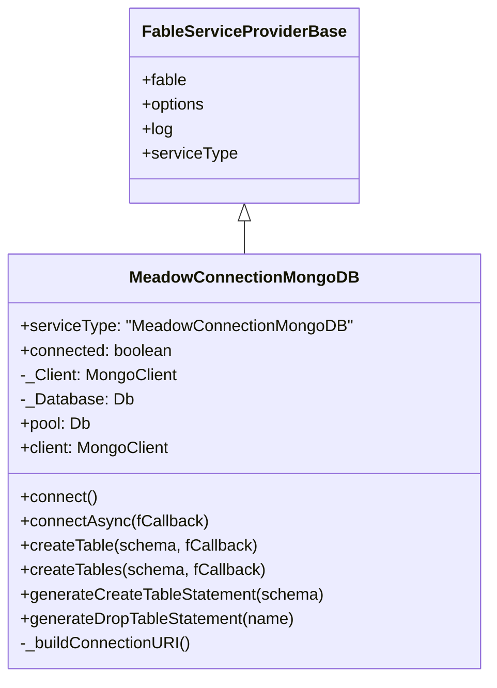

# Architecture

## System Overview

The MongoDB connector bridges Meadow's data access abstraction with the official MongoDB Node.js driver. It follows the Fable service provider pattern, providing connection management, collection creation, and index generation.

<!-- bespoke diagram: edit diagrams/system-overview.mmd or .hints.json, then: npx pict-renderer-graph build modules/meadow/meadow-connection-mongodb/docs -->

## Connection Lifecycle

<!-- bespoke diagram: edit diagrams/connection-lifecycle.mmd or .hints.json, then: npx pict-renderer-graph build modules/meadow/meadow-connection-mongodb/docs -->

## Service Provider Model

`MeadowConnectionMongoDB` extends `fable-serviceproviderbase`, providing standard lifecycle integration with the Fable ecosystem.

## Settings Flow

<!-- bespoke diagram: edit diagrams/settings-flow.mmd or .hints.json, then: npx pict-renderer-graph build modules/meadow/meadow-connection-mongodb/docs -->

## Collection Creation Flow

<!-- bespoke diagram: edit diagrams/collection-creation-flow.mmd or .hints.json, then: npx pict-renderer-graph build modules/meadow/meadow-connection-mongodb/docs -->

## Connection Safety

The connector includes several safety mechanisms:

<!-- bespoke diagram: edit diagrams/connection-safety.mmd or .hints.json, then: npx pict-renderer-graph build modules/meadow/meadow-connection-mongodb/docs -->

Key safety features:

| Feature | Implementation |
|---------|---------------|
| Double-connect guard | Logs error and returns if `_Client` already exists |
| Password masking | Cleansed settings logged on double-connect attempt |
| Missing callback guard | `connectAsync()` provides a no-op callback if none given |
| Idempotent collections | Error code 48 (NamespaceExists) is handled gracefully |
| URL-encoded credentials | `encodeURIComponent()` used for user and password in URI |

## Connector Comparison

| Feature | MongoDB | MySQL | MSSQL | SQLite |
|---------|---------|-------|-------|--------|
| Driver | `mongodb` | `mysql2` | `mssql` | `better-sqlite3` |
| Connection | URI-based | Pool | Pool | File path |
| Schema | Collections + Indexes | SQL DDL | SQL DDL | SQL DDL |
| `pool` returns | `Db` instance | MySQL Pool | MSSQL Pool | SQLite Database |
| Async queries | Promise-based | Callback | Callback | Synchronous |
| Schema idempotent | Error code 48 handling | `IF NOT EXISTS` | `IF NOT EXISTS` | `IF NOT EXISTS` |
| Connection pool | Built into MongoClient | Configurable | Configurable | N/A (single file) |
